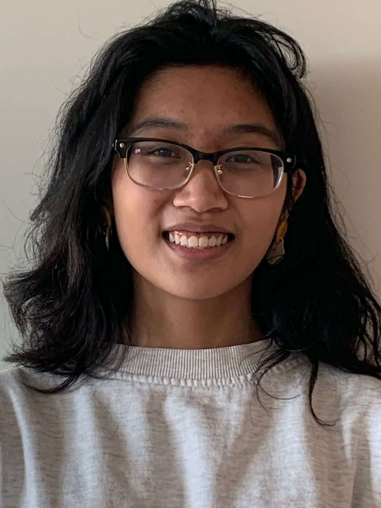

## About Me

Hello world!

I'm an undergraduate student studying international relations and modern languages at [San Francisco State University](https://sfsu.edu/). My research interests are nationalism, critical security studies, and terrorism, concentrating in Greater China and Western Europe. I am also currently learning Python and R!

San Francisco, USA
Email: aabadmailbox [at] tutanota [dot] de
[Github](https://github.com/arabellaabad)
[LinkedIn](https://www.linkedin.com/in/arabella-abad/)

---

## Conferences

Year | Conference | Title
-----|-------|--------
2022 | College of Liberal and Creative Arts Undergraduate Research Showcase | "Juicy Girls" and Camptowns: Examining the Bond Between American Military Bases and Sex Trafficking

---

## Awards

1. **Benny & May Chin Scholarship in International Relations**, *Kenny and Maria C. Chin Foundation*, Spring 2023. 
2. [**Critical Language Scholarship (Virtual, Dalian)**](https://clscholarship.org/), *U.S. Department of State*, Summer 2022.
    * Attended 8 weeks of intensive advanced Chinese language classes hosted by Dalian University of Technology
    * Conducted two presentations on sustainable development goals and methods
    * Memorized and recited 春江花月夜 by 張若虛 at student performance exhibition
2. **Steve Postle Memorial Scholarship**, *New Haven Schools Foundation*, June 2020. 
