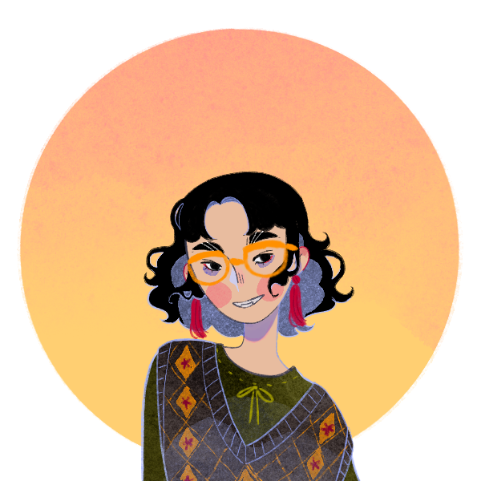

# This page is still under construction.

---

## About Me

Hi! My name's Arabella and I'm an undergraduate student studying international relations.

---

## Research Interest

I'm interested in researching nationalism, critical security studies, and terrorism, concentrating in East Asia and Western Europe.

---

## Education

1. F.Bar, J.Doe: Effects of having a placeholder of a name
2. S.Holmes, J.Watson: Consequences of living with a sociopath in London

---

## Work Experience

#### Reading and Writing Tutor - Tutoring and Academic Support Center (TASC)
###### August 2022 - Present
* job responsibility 1
* job responsibility 2

---

## Conferences

Year | Conference | Title
-----|-------|--------
2022 | College of Liberal and Creative Arts Undergraduate Research Showcase | "Juicy Girls" and Camptowns: Examining the Bond Between American Military Bases and Sex Trafficking
